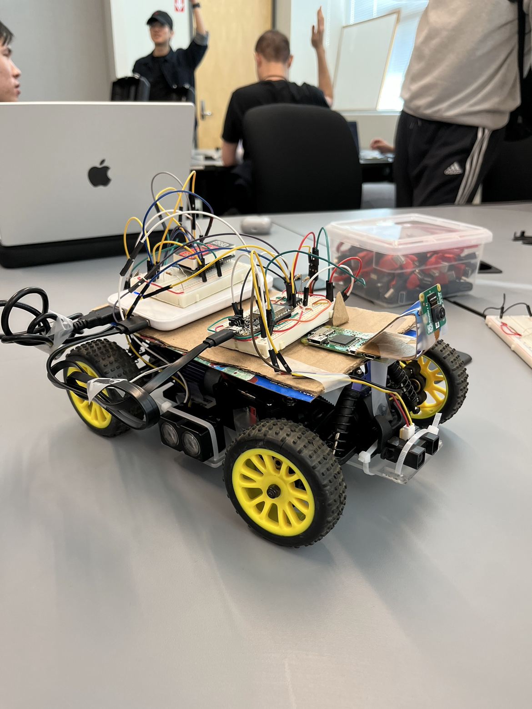
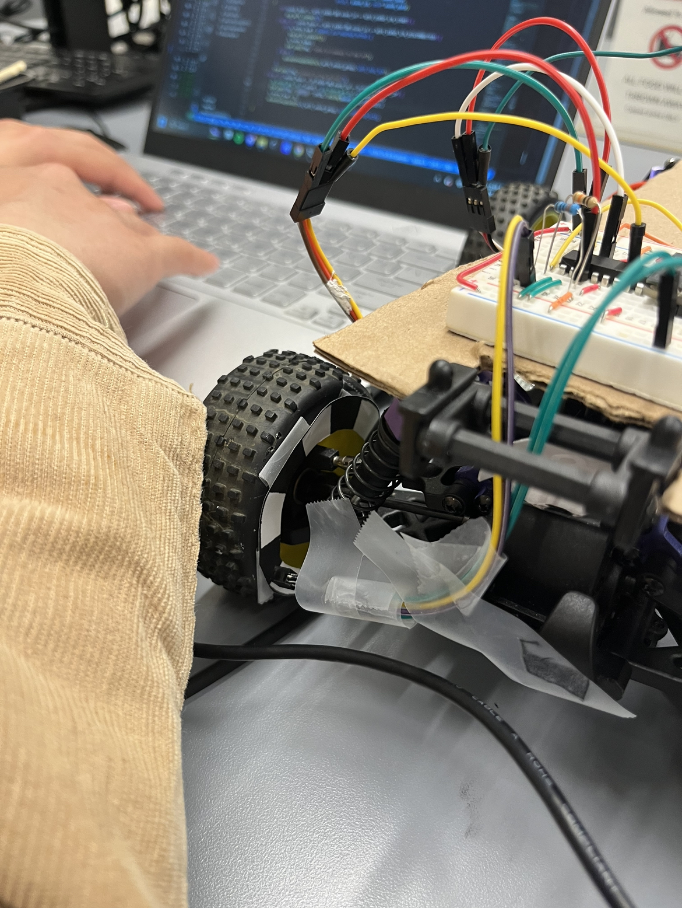
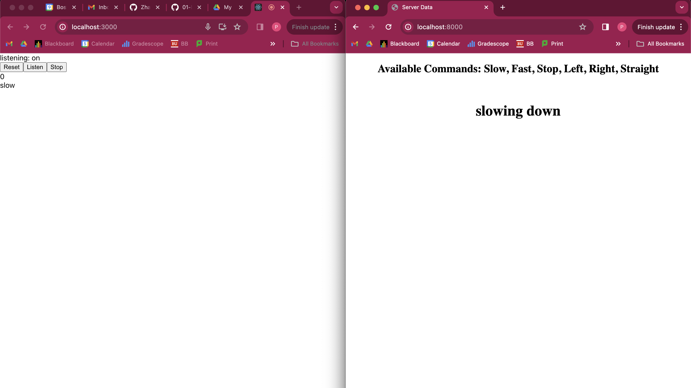

# Talk2Car
Authors: Peter Zhao, Jared Solis, Sourav Shib
Date: 2024-04-09

### Summary

This repository contains all the code and documentation for the group's Talk2Car quest, a smart car that takes in speech commands. The code folder contains the ESP32 code, node files, and a README detailing the specifics of the software development.

### Self-Assessment 

| Objective Criterion | Rating | Max Value  | 
|---------------------------------------------|:-----------:|:---------:|
| Objective One | 1 |  1     | 
| Objective Two | 1 |  1     | 
| Objective Three | 1 |  1     | 
| Objective Four | 1 |  1     | 
| Objective Five | 1 |  1     | 
| Objective Six | 1 |  1     | 
| Objective Seven | 1 |  1     | 

### Solution Design

Our team's solution design is a smart car equipped with IR/LIDAR sensors and rotary encoder controlled by the ESP32 with wireless control over a fully functional web application built on React and NodeJS. Through the remote server, one can input a set of commands ('slow', 'fast', 'stop', 'left', 'right', 'straight') through speech to send to the car, where they are executed. The IR sensor is mounted at the front for collision detection, and the LIDAR is mounted on the side for measuring distance from the side wall. This, combined with the rotary encoder at the wheel, allowed us to implement PID control for maintaining a fixed speed and distance from the wall. Finally, the speed is displayed on the onboard alpha display.

### Sketches/Diagrams

Final Prototype

 

Rotary Encoder

 

Server Speech-to-text Output

### Investigative Question
How would you change your solution if you were asked to provide 'adaptive' cruise control?
One part of the solution I would keep the same if we were asked to provide 'adaptive' cruise control is how the car retains its speed after a collision state so it can start going again. However, I would change that speed to the minimum to account for safety in the case of another potential collision in the near future. I would also add LIDAR sensors on the front, left side, and back of the car as they are more accurate than the IR Sensors and are needed in every direction to keep the driver safe. Code-wise, I would also tweak the speed PID to not keep it constant but instead adapt for how close things are in the sensors.

### Supporting Artifacts
- [Link to Quest 4 Presentation](https://drive.google.com/file/d/1_oPMYxpqPxcTBWXNQTkSyb5RmeS8ojjr/view?usp=sharing).
- [Link to Quest 4 demo](https://drive.google.com/file/d/1nfw1iRywhCnJt-Sl4OOZ_YAu-K7BYKvg/view?usp=sharing). 

